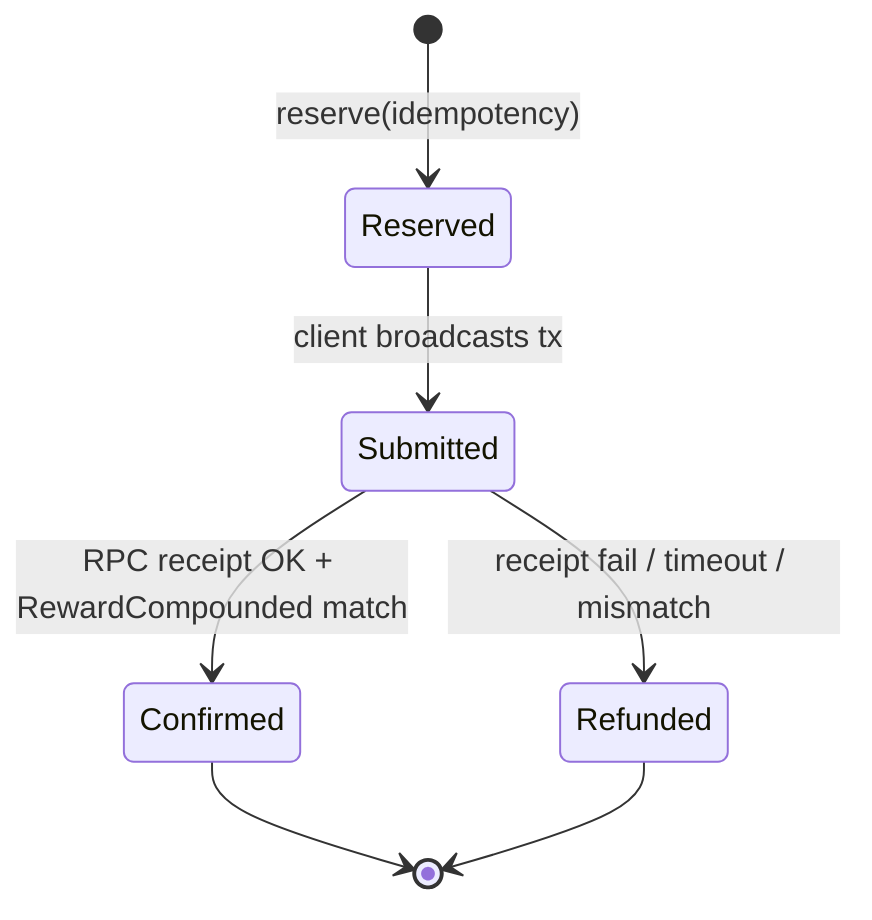

# Read-Only Remediation Plan

**Sources:** `docs/FULL_PROTOCOL_AUDIT.md`, `docs/FULL_PROTOCOL_AUDIT_SUMMARY.md`  
**Date:** 2026-09-14  
**Constraints:** Planning only — **no code changes, no deploy, no on-chain transactions** in this document’s execution.

---

## How to read each finding

Each **CRITICAL** and **HIGH** item includes: (1) Finding, (2) Location, (3) Why dangerous, (4) Current behavior, (5) Target behavior, (6) Code changes, (7) Solidity changes, (8) DB/migrations, (9) Deploy/config, (10) Tests, (11) Testnet verification, (12) Mainnet impact, (13) Dependencies / order.

---

# PHASE 1 — CRITICAL

**Phase risk (if implemented carelessly):** Loss of user funds (virtual wallet), wrong claim policy on-chain, broken ICO/engine wiring after redeploy.  
**Prerequisites:** MultiSig signers available on testnet; frozen tokenomics review (no supply/allocation changes); backup `deployment.json` and DB.  
**Rollback strategy:** Keep old Engine address in manifest backup; Laravel `.env` dual-read period; do not destroy old contract (immutable stakes remain on old engine until migrated or frozen UX).  
**Verification commands (phase gate):**

```powershell
cd c:\xampp\htdocs\Rynexcapital\contracts
npx hardhat test --grep "ClaimPolicy"
node scripts/check-testnet-deployment.js
cd c:\xampp\htdocs\Rynexcapital
php artisan test --filter=VirtualIncomeWallet
php scripts/verify-known-ico-tx.php
```

---

## C-1 — Live testnet Engine lacks claim policy bytecode

### 1. Finding

Deployed `RaceCommunityEngine` at `0xc0D9Dee1476D67379069444A7e5f1b340f91F4E9` does not expose repository claim-policy interface (`claimEnabled()`, `canClaimRewards()`, `lastSuccessfulClaimAt`, 24h cooldown in `_claimReward`).

### 2. Exact file/contract/function

| Layer | Location |
|-------|----------|
| Solidity (target) | `contracts/src/RaceCommunityEngine.sol` — `claimEnabled`, `lastSuccessfulClaimAt`, `setClaimEnabled`, `canClaimRewards`, `_claimReward` gates, events `ClaimEnabledUpdated`, `ClaimCooldownRecorded` |
| Deploy manifest | `contracts/deployments/bscTestnet/deployment.json` — `raceCommunityEngine`, `linkages.vaultEngine`, `linkages.icoStakingEngine` |
| Frontend reads | `resources/js/lib/web3Engine.js` — `readClaimPolicyState`, selectors `claimEnabled` (`0x2866ed21`), `canClaimRewards`, `nextAllowedClaimAt` |
| Docs | `docs/CLAIM_ACTIVATION_24H_POLICY.md` |
| Tests | `contracts/test/RaceCommunityEngineClaimPolicy.test.js` |

### 3. Why it is dangerous

Users and admins may assume ICO-complete + admin activation + 24h cooldown are enforced on-chain; on old bytecode they are **not**, so claims may run without intended gates (or UI shows “unsupported” while chain allows ungated claims depending on legacy logic).

### 4. Current behavior

- Repository source and Hardhat tests implement full policy.
- `deployment.json` note: *“Resumed post-deploy — contracts NOT redeployed.”*
- `readClaimPolicyState()` treats empty `eth_call` as `supported: false` (frontend safe-read).
- Read-only probe with current ABI against live address returns **empty data** for `claimEnabled()` (function absent on deployed bytecode).

### 5. Target behavior

- Live Engine bytecode matches `RaceCommunityEngine.sol` claim policy.
- `claimEnabled == false` by default until MultiSig calls `setClaimEnabled(true)` **after** `RaceICO.icoCompleted()`.
- Successful `claimReward` updates `lastSuccessfulClaimAt[user]`; failed txs do not.
- ICO, Vault, Oracle, Laravel, and frontend all reference **one** Engine address.

### 6. Required code changes (Laravel / JS)

- Update `config/blockchain.php` / `.env` `RACE_COMMUNITY_ENGINE_CONTRACT` when address changes.
- Ensure Inertia shared `blockchain.contracts.community_engine` matches manifest.
- Optional: admin/read-only health command that `eth_call`s `claimEnabled()` and fails CI if `0x`.
- No business-logic change to income formulas.

### 7. Required Solidity changes

**None to tokenomics.** Deploy **new** `RaceCommunityEngine` instance from current `RaceCommunityEngine.sol` (same constructor args pattern as `contracts/scripts/deploy.js`: oracle, vault, treasury, ICO wiring).

### 8. Required migration/database changes

- **No schema change** for Engine redeploy.
- Re-index stakes for new address: extend `blockchain_index_state` cursor for new engine contract OR new row; backfill `blockchain_engine_stakes` from logs if address changes (operational job, not automatic in audit).
- Existing `ico_purchases` / stakes tied to **old** engine remain valid historically; new purchases must use relinked ICO.

### 9. Required deployment/config changes

**Exact deployment / relink sequence (testnet, MultiSig-owned):**

1. **Deploy** new `RaceCommunityEngine` (testnet script path only; `DEPLOY_ENV=testnet`, chain 97).
2. **RaceRewardVault** — `setEngine(newEngine)` (MultiSig tx).
3. **RaceICO** — `setStakingEngine(newEngine)` (MultiSig tx); confirm `adminWallet` unchanged.
4. **New Engine** — wire `setIcoContract(ico)`, `setRewardPriceOracle(oracle)`, maturity treasury per deploy script assertions.
5. **Transfer ownership** of new Engine to `raceMultiSig` (if deployer holds temporarily).
6. **Do not redeploy RaceCoin** — minters remain ICO + Vault.
7. **Claim activation** — after ICO complete: MultiSig → `setClaimEnabled(true)` on **new** Engine only.
8. Update `contracts/deployments/bscTestnet/deployment.json` (`raceCommunityEngine`, `linkages.*`, `note` with redeploy block/time).
9. Laravel `.env`: `RACE_COMMUNITY_ENGINE_CONTRACT`, indexer start block if rescan needed.
10. **Legacy Engine `0xc0D9…`:** mark **DEPRECATED** in docs/config; UI warning if user still has stakes only on old contract (migration policy is product decision — audit recommends read-only display of old stakes, disable new ICO path to old engine).

**Interface comparison (repository vs deployed `0xc0D9…`):**

| Capability | Repository | Deployed `0xc0D9…` (evidence) |
|------------|------------|-------------------------------|
| `claimEnabled()` | Public getter | **Absent** (`eth_call` → `0x`) |
| `setClaimEnabled(bool)` | `onlyOwner` | **Absent** |
| `lastSuccessfulClaimAt(address)` | Mapping getter | **Absent** |
| `canClaimRewards(address)` | View | **Absent** |
| `ClaimEnabledUpdated` / `ClaimCooldownRecorded` | Emitted | Indexer maps exist but **never emitted** on old deploy |
| `claimReward` cooldown | `_claimReward` requires 24h | **Old behavior** (no gate) |

### 10. Required tests

- `contracts/test/RaceCommunityEngineClaimPolicy.test.js` — full suite on fresh deploy.
- `contracts/scripts/uat-testnet-e2e.js` — post-relink config checks.
- Frontend manual: `readClaimPolicyState` returns `supported: true` on new address.

### 11. Testnet verification steps

```powershell
# After future redeploy only (not executed in this plan):
cd c:\xampp\htdocs\Rynexcapital\contracts
$env:HARDHAT_NETWORK="bscTestnet"
node -e "const hre=require('hardhat'); (async()=>{ const a='NEW_ENGINE_ADDRESS'; const e=await hre.ethers.getContractAt('RaceCommunityEngine', a); console.log(await e.claimEnabled()); })();"

cd c:\xampp\htdocs\Rynexcapital
php artisan blockchain:index-events
php scripts/verify-known-ico-tx.php
```

- Confirm `vault.engine()` and `ico.stakingEngine()` equal new address (read-only `check-testnet-deployment.js`).

### 12. Mainnet impact

Same relink pattern required on mainnet **before** public claim; wrong order (ICO pointing to old engine) would strand minted RACE on wrong engine. **NO-GO** until live `claimEnabled` probe passes on production Engine address.

### 13. Dependencies / order

**Must happen before:** on-chain claim UAT, H-9 closure, testnet exit claim criteria.  
**Blocks:** C-2 compound on-chain verification UX (users compound against engine address from config).  
**Parallel:** Indexer topic fixes (H-2) can proceed independently.

---

## C-2 — Virtual compound confirm trusts `tx_hash` without chain proof

### 1. Finding

`VirtualIncomeCompoundService::confirmOnChain` persists `tx_hash` in metadata without verifying receipt status, sender, contract, or `RewardCompounded` / stake update.

### 2. Exact file/contract/function

| Layer | Location |
|-------|----------|
| PHP | `app/Services/Income/VirtualIncomeCompoundService.php` — `reserve()`, `confirmOnChain()` |
| HTTP | `app/Http/Controllers/VirtualIncomeCompoundController.php` — `confirm()` |
| On-chain target | `RaceCommunityEngine.compoundReward(uint256 stakeIndex)` → `RewardCompounded` event |
| Virtual debit | `VirtualIncomeWalletService::debit()` — `TYPE_COMPOUND`, idempotency from client |

### 3. Why it is dangerous

Attacker or buggy client can **finalize** a compound after `reserve` debited virtual balance using a ** unrelated or failed** tx hash → **virtual double-spend** vs on-chain stake (user loses virtual USD notional without matching stake increase).

### 4. Current behavior

1. `reserve` — idempotent virtual **debit**, metadata `phase: reserved`, `on_chain_required: true`.
2. User submits chain tx (client-side).
3. `confirmOnChain` — regex-validates hash, sets `metadata.tx_hash`, `phase: confirmed_on_chain` — **no RPC**.

### 5. Target behavior

Idempotent state machine:

| State | Virtual balance | On-chain |
|-------|-----------------|----------|
| `reserved` | Debited | No proof yet |
| `submitted` | Debited | Tx hash recorded, receipt pending |
| `confirmed` | Debited (final) | Receipt success + log proof |
| `failed` / `expired` | **Credited back** | No valid compound |

### 6. Required code changes (design)

**New / extended service methods (conceptual):**

1. **`reserve`** — unchanged; add TTL in metadata (`reserved_until`).
2. **`submitTxHash`** (optional split) — store hash, enqueue verification job.
3. **`verifyAndFinalize`** — core logic:
   - `eth_getTransactionReceipt(txHash)`
   - `status == 0x1`
   - `from` == user’s `wallet_address` (case-insensitive)
   - Log from `config('blockchain.contracts.community_engine')` matching `RewardCompounded` topic `0x172683bc9e168fd8e43e442d0e5392595c48b43230044dee7c406e017e52c510`
   - Decode `stakeIndex`, `rewardUsdt`, `user` indexed — match reserved `stake_index` and amount tolerance (BCMath).
   - Duplicate tx_hash globally rejected (already partially present).
4. **`refundReserve`** — credit virtual wallet `TYPE_COMPOUND_REFUND` idempotency `compound_refund:{idempotency_key}` if verification fails or TTL exceeded.
5. **Scheduled command** `income:reconcile-pending-compounds` — poll pending rows; auto-refund after N hours.

**Use existing:** `App\Services\Blockchain\BscJsonRpcClient` (read-only RPC).

### 7. Required Solidity changes

**None** (behavior already on Engine). Ensure deployed Engine matches C-1 before verifying events.

### 8. Required migration/database changes

- Add columns or metadata schema doc: `compound_status` enum in `income_wallet_transactions.metadata` (no migration strictly required if JSON metadata sufficient).
- Optional table `compound_reservations` for audit — only if metadata insufficient.
- Unique index on `(metadata->tx_hash)` for `TYPE_COMPOUND` where confirmed — enforce at DB level.

### 9. Required deployment/config changes

- `config/blockchain.php` — engine address must match C-1.
- Queue worker for async verification (Redis/database queue).

### 10. Required tests

- Feature: confirm with **mocked RPC** returning failed receipt → refund, balance restored.
- Feature: confirm with valid receipt + mocked logs → confirmed, no refund.
- Feature: duplicate confirm idempotent.
- Feature: wrong stake index in log → reject + refund.
- Extend `tests/Feature/VirtualIncomeWalletArchitectureTest.php`.

### 11. Testnet verification steps

1. Hybrid mode user with virtual balance.
2. `reserve` → broadcast real `compoundReward` on testnet → `confirm` only after verifier passes.
3. Attempt confirm with ICO tx hash `0xd6a8025c…` → must **fail** and refund.

```powershell
php artisan test --filter=VirtualIncomeCompound
```

### 12. Mainnet impact

**CRITICAL** on mainnet launch — same verifier mandatory before GO.

### 13. Dependencies / order

**After:** C-1 Engine address stable.  
**Before:** MAINNET GO for virtual compound path.  
**Related:** H-7 (duplicate finding — same fix).

### C-2 — Flow diagram (target)



---

# PHASE 2 — HIGH

**Phase risk:** Incorrect balances, indexer blind spots, env miswire to mainnet, test regressions.  
**Prerequisites:** Phase 1 plan approved; hybrid test env documented.  
**Rollback:** Revert Laravel deploy; restore `.env`; indexer topic map backward compatible (keep old topic aliases).  
**Verification commands:**

```powershell
php artisan test
php scripts/verify-known-ico-tx.php
php artisan blockchain:index-events --dry-run
grep -R "BSC_CHAIN_ID" .env.example config/blockchain.php
```

---

## H-1 — Withdrawal reject does not reverse virtual debit (and related fee side effects)

### 1. Finding

`WithdrawalService::reject()` sets status only; virtual gross reserved at `request()` is not credited back.

### 2. Location

- `app/Services/Income/WithdrawalService.php` — `request()` (lines ~205–219 debit), `reject()` (~348–360)
- `app/Orchid/Screens/Data/WithdrawalEditScreen.php` — calls `reject()`
- Side effects at request: `creditCashOutAdminFee()`, `AffiliateTeamRewardsService::onWithdrawal()`

### 3. Why dangerous

User loses virtual income permanently on admin reject; support burden; perceived theft.

### 4. Current behavior

- Request: virtual debit `withdrawal_request:{id}`; team rewards + admin fee ledger credits run immediately.
- Reject: `status = rejected` only.

### 5. Target behavior

**Single DB transaction boundary for `reject()`:**

```
BEGIN
  LOCK withdrawal FOR UPDATE
  IF status NOT IN (pending) → abort
  IF status already rejected → idempotent return
  VirtualIncomeWalletService::credit(
    type: withdrawal_refund OR reuse TYPE_WITHDRAWAL with signed amount,
    idempotency_key: withdrawal_reject_refund:{id},
    reference: withdrawal:{id}
  )
  Reverse team reward ledger entries IF policy requires (mirror debit on uplines via compensating entries — separate idempotency keys)
  Reverse company admin fee ledger IF credited at request (compensating TYPE_WITHDRAWAL_ADMIN_FEE negative or reversal entry)
  SET withdrawal.status = rejected
COMMIT
```

**Policy choice (document in implementation):**

- **Option A (recommended):** Defer team reward + admin fee ledger until **approve** (only virtual debit at request) — larger behavior change.
- **Option B (minimal):** Keep request-time fees but **compensate on reject** with paired reversal entries + virtual credit for full gross.

### 6–7. Code / Solidity

- Laravel only; no Solidity.

### 8. DB

- Optional `withdrawal_reversals` audit table; or rely on `income_wallet_transactions` + `ledger_entries` with idempotency.

### 9. Config

- None.

### 10. Tests

- Extend `ClaimVirtualIncomeWithdrawalPolicyTest` or new `WithdrawalRejectRefundTest`: request → reject → balance equals pre-request.
- If Option B: assert upline virtual balance reversed.

### 11. Testnet verification

Manual Orchid reject after test withdrawal in staging DB copy.

### 12. Mainnet

Same logic required for production admin panel.

### 13. Order

**Before** testnet exit withdrawal criteria; **parallel** with C-2; **after** virtual wallet backfill (M-VI-4) if historical rejects exist.

---

## H-2 — Indexer decodes 4/8 known ICO tx events as `Unknown`

### 1. Finding

Tx `0xd6a8025c…` stores 8 rows in `blockchain_events`; 4 named, 4 `Unknown`.

### 2. Location

- `app/Console/Commands/IndexBlockchainEventsCommand.php` — `resolveEventName()` topic map (~267–298)
- Indexed contracts: engine, participation, ICO only (not USDT/RACE token contracts)

### 3. Why dangerous

Dashboards and ops tools miss **MemberRegistered**, **MemberActivated**, **ICOPurchase**, **UsdtTransferredToAdmin**; wrong legacy topic hashes may mis-decode other txs.

### 4. Current behavior

| log_index | contract | topic0 | Stored name | Should be |
|-----------|----------|--------|-------------|-----------|
| 22 | engine | `0x3a5a00ec…` | **Unknown** | `MemberRegistered` |
| 23 | engine | `0xe1ff4f9b…` | **Unknown** | `MemberActivated` |
| 26 | ICO | `0x1f3dc78e…` | **Unknown** | `ICOPurchase` |
| 28 | ICO | `0x49dfa5ea…` | **Unknown** | `UsdtTransferredToAdmin` |

**Mapped correctly in same tx:** `ICOStakeCreated`, `ParticipationPurchased`, `ICOPurchased`, `RaceMintedToStaking`.

**Not stored (3 logs — out of scope for 8 rows):** USDT `Transfer` (log 19), RACE `Transfer` + `MinterMint` (20–21) — contracts not in indexer list.

**Stale/wrong entries in map:**

- `MemberRegistered` mapped to `0x03c7da3f…` — **does not match** current Solidity (`0x3a5a00ec…`).
- `MemberActivated` mapped to `0x37a30c83…` — **does not match** (`0xe1ff4f9b…`).

### 5. Target behavior

- Add topics: `ICOPurchase`, `UsdtTransferredToAdmin`.
- Fix `MemberRegistered` / `MemberActivated` hashes to match `RaceCommunityEngine.sol`.
- Keep duplicate aliases for legacy deployments if needed (document both topic0 values).
- Optional: index `RaceCoin` + USDT for `Transfer`/`MinterMint` (separate scope).

### 6–7. Code / Solidity

- PHP map only; Solidity unchanged.

### 8. DB

- Optional one-time SQL update to rename existing `Unknown` rows for known tx (ops script, not migration).

### 9. Config

- None.

### 10. Tests

- Unit test: `resolveEventName` for four topic0 values above.
- Integration: re-run indexer idempotent — no duplicate rows.

### 11. Testnet verification

```powershell
php artisan blockchain:index-events
php scripts/verify-known-ico-tx.php
# Expect 8 rows, 0 Unknown for that tx (or 4 Unknown → 0 after backfill rename)
```

### 12. Mainnet

Same map required before production indexing.

### 13. Order

Independent of C-1; should complete before testnet exit indexer criteria.

---

## H-3 — Triple balance sources without reconciliation

### 1. Finding

Operational truth split across `user_wallets` / `users.balance_usd`, `ledger_entries`, and `income_wallet_transactions`.

### 2. Location

- `app/Services/Income/WalletBalanceService.php` — documents virtual as authoritative for income ops
- `app/Services/Income/VirtualIncomeWalletService.php`
- `app/Services/Income/LedgerWriter.php` — mirror rules in `config/virtual_income_wallet.php`
- Withdrawals still write `ledger_entries` on approve

### 3. Why dangerous

Support compares wrong balance; approve fails despite user believing balance sufficient; finance reports diverge.

### 4. Current behavior

- **Virtual income operations** (claim, withdraw request, compound reserve) use `VirtualIncomeWalletService`.
- **Legacy** `user_wallets` updated via `recalculateFromLedger()` for deposit/investment path.
- Mirror excludes `wallet_withdrawal`, `roi_accrual`, deposits.

### 5. Target behavior — single authority

| Domain | Authoritative source | Role of others |
|--------|---------------------|----------------|
| Earned income (claim/withdraw/compound) | **`income_wallet_transactions`** sum | `ledger_entries` = audit mirror; optional cross-check |
| Deposits / investment USDT wallet | **`ledger_entries`** + `user_wallets` cache | Do not use for virtual income |
| On-chain stake/RACE | **BSC Engine + indexer** | Laravel read models |

**Reconciliation job (design):**

- Daily `php artisan income:reconcile-wallets`:
  - For each user: `virtual_balance` vs sum of mirrored ledger types ± known exclusions.
  - Flag drift > $0.01.
- Admin read-only report — no auto-mutate without approval.

### 6–9. Code / DB / deploy

- Artisan command + admin screen (planning).
- Optional migration: deprecate `users.balance_usd` display in favor of computed fields.

### 10. Tests

- Feature: after claim + withdraw + reject refund, reconciliation PASS.

### 11–13. Verification / mainnet / order

After H-1 and virtual wallet backfill (M-VI-4). Before MAINNET GO finance sign-off.

---

## H-4 — `REWARDS_ENGINE=blockchain_only` vs Laravel virtual income UX

### 1. Finding

Production `.env` often sets `REWARDS_ENGINE=blockchain_only`, which disables Laravel ROI accrual/claim, while routes and pages for virtual income remain visible.

### 2. Exact file/contract/function

- `app/Support/BlockchainMode.php` — `assertReadOnlyRewards()`, engine mode checks
- `app/Console/Commands/IncomePayRoiCommand.php`, `app/Services/Income/IncomeClaimService.php`
- Routes/controllers for `/virtual-income`, `POST /income/claim`
- `phpunit.xml` — hybrid for tests only
- `.env.example`, `docs/VIRTUAL_INCOME_WALLET_ARCHITECTURE.md`

### 3. Why it is dangerous

Users see empty or stale balances; support instructs “claim” while cron never accrues; testers assume PHPUnit behavior matches production.

### 4. Current behavior

- Testnet `.env` pattern: `blockchain_only` + `PARTICIPATION_ON_CHAIN=false` common.
- Virtual wallet credits only when hybrid paths run (ROI cron, claim API).
- On-chain rewards independent but UI mixes both.

### 5. Target behavior

- Explicit **mode matrix** documented and enforced in UI:
  - `blockchain_only`: hide/disable Laravel claim + virtual accrual UI **or** show banner “Rewards on-chain only”.
  - `hybrid`: full virtual wallet path as designed.
- Ops runbook: one mode per environment.

### 6. Required code changes

- Middleware or Inertia shared prop `rewardsEngineMode`.
- Blade/React gates on Investment, VirtualIncomeWallet, Withdrawal copy.
- Optional: `BlockchainMode::assertHybrid()` on claim routes only.

### 7. Required Solidity changes

None.

### 8. Required migration/database changes

None.

### 9. Required deployment/config changes

- `.env.example` — comment required mode per deploy target.
- CI staging `.env` — `REWARDS_ENGINE=hybrid` for UAT if testing virtual path.

### 10. Required tests

- Feature: `blockchain_only` → claim route 403 or structured error.
- Feature: hybrid → claim succeeds with virtual credit.

### 11. Testnet verification steps

```powershell
php artisan config:show rewards.engine
# Manual: toggle .env, load /virtual-income and /investment — UI matches mode
```

### 12. Mainnet impact

Product must choose **single user-facing reward story** before launch (on-chain claim vs Laravel virtual).

### 13. Dependencies / order

After H-3 reconciliation defined; parallel to C-1; before TESTNET UAT sign-off.

---

## H-5 — Legacy `RaceParticipation` still deployed and configurable

### 1. Finding

Testnet `RaceParticipation` at `0x9BF2…` remains in manifest and indexer contract list alongside `RaceCommunityEngine`.

### 2. Exact file/contract/function

- `contracts/deployments/bscTestnet/deployment.json` — `raceParticipation`
- `config/blockchain.php` — `contracts.participation`
- `app/Console/Commands/IndexBlockchainEventsCommand.php` — `$contracts` array includes participation
- Legacy Solidity: `contracts/src/RaceParticipation.sol` (if present in repo)

### 3. Why it is dangerous

Dual participate/claim paths; indexer and UI may attribute events to wrong product surface.

### 4. Current behavior

Indexer scans participation address (0 logs on known range but still configured).
Frontend primary path is Engine (`web3Engine.js`); participation may remain in old pages/config.

### 5. Target behavior

- Participation **DEPRECATED** in config/docs.
- Indexer and Laravel **do not** load participation address on new deployments.
- UI hard-error if user attempts participation contract calls.

### 6. Required code changes

- Remove participation from `$contracts` when env blank.
- Grep frontend for participation contract usage; redirect to Engine flows.

### 7. Required Solidity changes

None (do not redeploy legacy unless retiring funds — out of scope).

### 8. Required migration/database changes

None; optional flag in `site_settings` `deprecated_participation_address`.

### 9. Required deployment/config changes

- Testnet `.env`: `RACE_PARTICIPATION_CONTRACT=` empty or commented.
- Document legacy address for block explorers only.

### 10. Required tests

- Indexer dry-run lists only engine + ICO contracts.

### 11. Testnet verification steps

```powershell
php artisan blockchain:index-events --dry-run
# Expect no participation line when env unset
```

### 12. Mainnet impact

Ensure mainnet `.env` never points users to Participation if Engine is canonical.

### 13. Dependencies / order

Independent; before public testnet marketing.

---

## H-6 — PHPUnit failures (6)

### 1. Finding

Full suite: **92 passed, 6 failed, 16 skipped** (audit run).

### 2. Exact file/contract/function

- `tests/Feature/WithdrawalRateLimitTest.php` — 3 cases; uses legacy wallet funding
- `tests/Feature/BuiltForGrowthDurationTest.php` — ROI percent vs config
- `tests/Feature/IdActivationTest.php` — activation null
- `tests/Feature/ProfileTest.php` — delete account expectations

### 3. Why it is dangerous

Regressions in withdrawal limits and auth slip to production; CI not trusted.

### 4. Current behavior

Rate limit tests fail `Insufficient Virtual Income Wallet balance` without virtual seed.
Other failures partially unrelated to virtual wallet.

### 5. Target behavior

All production-critical tests pass; skips documented with `@group` reason.

### 6. Required code changes

- Test helpers: `seedVirtualIncome(User, amount)` using `VirtualIncomeWalletService` or factory.
- Update BuiltForGrowth/Profile/Id tests to match current config and routes.

### 7–8. Solidity / migrations

None.

### 9. Required deployment/config changes

- `phpunit.xml` documents hybrid mode (already).

### 10. Required tests

Self-fixing — full `php artisan test` green.

### 11. Testnet verification steps

```powershell
php artisan test
```

### 12. Mainnet impact

CI gate for any release candidate.

### 13. Dependencies / order

After H-1 virtual refund tests added; parallel H-3.

---

## H-7 — Compound confirm trust model

**Same remediation as C-2** — duplicate audit ID; close with C-2 implementation.

---

## H-8 — Default `BSC_CHAIN_ID` 56 in Laravel config

### 1. Finding

Unset `BSC_CHAIN_ID` defaults Laravel to chain **56** while testnet manifest uses **97**.

### 2. Exact file/contract/function

- `config/blockchain.php` — `'chain_id' => (int) env('BSC_CHAIN_ID', 56)`
- `app/Services/Blockchain/BscJsonRpcClient.php` — `assertExpectedChain()`
- `app/Console/Commands/IndexBlockchainEventsCommand.php` — mainnet refuse guard
- `contracts/scripts/deploy.js` — testnet guards

### 3. Why it is dangerous

Indexer/RPC against wrong chain; testnet contract addresses on mainnet RPC; financial reads wrong.

### 4. Current behavior

If `.env` missing `BSC_CHAIN_ID`, app assumes BSC mainnet.
Guards partially protect indexer when `CONFIRM_TESTNET_DEPLOYMENT` set.

### 5. Target behavior

- Testnet deploy bundle: **boot fails** if `RACE_COMMUNITY_ENGINE_CONTRACT` matches testnet manifest and `chain_id !== 97`.
- Mainnet bundle: fails if chain 97 with mainnet USDT address.
- No silent default 56 on testnet hosts.

### 6. Required code changes

- `App\Providers\AppServiceProvider::boot()` or dedicated `BlockchainConfigValidator`.
- Clear exception message listing required `.env` keys.

### 7. Required Solidity changes

None.

### 8. Required migration/database changes

None.

### 9. Required deployment/config changes

- `.env.example`: `BSC_CHAIN_ID=97` for testnet section mandatory.
- Hosting checklist.

### 10. Required tests

- Unit: validator throws on mismatch fixtures.

### 11. Testnet verification steps

```powershell
php artisan config:show blockchain.chain_id
php artisan blockchain:index-events --dry-run
```

### 12. Mainnet impact

Mainnet must set `BSC_CHAIN_ID=56` explicitly — validator allows 56 only with mainnet address set.

### 13. Dependencies / order

Before any indexer cron on new servers; parallel H-2.

---

## H-9 — On-chain claim enforcement absent on old engine

### 1. Finding

Frontend and policy docs assume `claimEnabled` + 24h cooldown; live Engine at `0xc0D9…` does not implement selectors.

### 2. Exact file/contract/function

Same as **C-1** plus `resources/js/Pages/Isu.jsx`, `RaceToken.jsx` — on-chain claim buttons.

### 3. Why it is dangerous

Users believe cooldown protects them; chain may allow claims without admin gate (legacy `_claimReward`).

### 4. Current behavior

`web3Engine.js` `readClaimPolicyState` → `supported: false`; claims may still be attempted via raw `claimReward` if rewards accrue.

### 5. Target behavior

Same as **C-1** — policy enforced on-chain; UI shows live `claimEnabled` / `nextAllowedClaimAt`.

### 6–13.

**Identical implementation order to C-1** — no separate fix. Verification: `claimEnabled()` eth_call non-empty on configured engine address.

---

# PHASE 3 — MEDIUM (grouped)

| ID | Finding | Primary location | Remediation summary |
|----|---------|------------------|---------------------|
| M-1 | No reconciliation job ledger ↔ virtual | VI-3 | See H-3 job |
| M-2 | Historical ledger not mirrored | VI-4 | Artisan `income:backfill-virtual-wallet` (idempotent) |
| M-3 | Indexer no reorg handling | `IndexBlockchainEventsCommand` | Confirmation depth + rewind cursor policy |
| M-4 | SSR chain_id 56 fallbacks | `Dashboard.jsx`, Inertia props | Use shared `blockchain.chain_id` only |
| M-5 | `ico_stakes` legacy table | DB | Read-only deprecation; stop writes |
| M-6 | Self-referral rules not exhaustively tested | Referral services | Add edge-case tests |
| M-7 | Governance dual systems confusion | RaceGovernance vs RaceGovernor | Docs + UI label legacy |
| M-8 | Liquidity locker null testnet | deployment.json | Document testnet LP manual process |
| M-9 | Oracle MEDIUM in summary table | Staleness ops | Heartbeat monitoring runbook |
| M-10 | Admin centralized payout | Orchid | Process doc (by design) |
| M-11 | Duplicate `ICOPurchase` vs `ICOPurchased` indexing | ICO events | Indexer decodes both; UI prefers `ICOPurchased` |
| M-12 | Withdrawal approve still checks virtual balance after request debit | `WithdrawalService::approve` | Document double-check intent; ensure not double debit |
| M-13 | Team rewards at request complicate reject | H-1 Option A/B | Align with H-1 |
| M-14 | No frontend automated tests | — | Add Vitest smoke for wallet network |

**Phase risk:** Medium — mostly ops/UX/reconciliation.  
**Prerequisites:** Phase 2 HIGH items for wallet integrity in progress.  
**Rollback:** Disable new Artisan commands via feature flag.  
**Verification:** `php artisan income:reconcile-wallets --dry-run` (future).

---

# PHASE 4 — LOW / INFO (grouped)

| ID | Finding | Remediation summary |
|----|---------|---------------------|
| L-1 | Stale built JS after config change | CI `npm run build` on deploy |
| L-2 | Dashboard default chain 56 prop | Align with M-4 |
| L-3 | INITIAL_MINT 1M vs ICO 600k disclosure | Update public tokenomics copy only |
| L-4 | Documentation vs `REWARDS_ENGINE` | Sync `.env.example` + ops runbook |
| L-5 | `RaceGovernor` legacy address in manifest | Label deprecated in UI |
| L-6 | Pancake vs oracle price user education | Tooltips in swap vs staking pages |
| L-7 | Manual payout approval latency | SLA doc |
| L-8 | Indexer stores wallet from topic heuristics | Improve parser when fixing H-2 |
| L-9 | Profile/id test failures | Fix when touching auth |
| L-10 | INFO: MultiSig no signer rotation | Document new deploy requirement |
| L-11 | INFO: Hardhat 132 tests strong | Maintain on each contract touch |
| L-12 | INFO: Secrets not in git | Keep pre-commit hook |

**Phase risk:** Low.  
**Verification:** Docs review checklist.

---

# Cross-cutting designs (requested detail)

## Withdrawal reject — transaction boundary (exact)

| Step | Action | Idempotency key |
|------|--------|-----------------|
| 1 | `BEGIN` | — |
| 2 | `SELECT withdrawals … FOR UPDATE` | — |
| 3 | Guard: `status === pending` | — |
| 4 | If `IncomeWalletTransaction` exists for `withdrawal_reject_refund:{id}` → skip credit, ensure rejected | `withdrawal_reject_refund:{id}` |
| 5 | Else `VirtualIncomeWalletService::credit(gross)` | same |
| 6 | Compensating ledger for team/admin fees if Option B | `withdrawal_reject_fee_reversal:{id}` |
| 7 | `UPDATE withdrawals SET status=rejected` | — |
| 8 | `COMMIT` | — |

**Must NOT run outside transaction:** virtual credit without status change (double refund risk).

## Indexer — full event map reference

**Implemented in** `IndexBlockchainEventsCommand::resolveEventName()` (29 named topics + Unknown fallback).

**Known ICO tx — 8 stored logs (engine + ICO contracts only):**

1. `MemberRegistered` — **fix map**
2. `MemberActivated` — **add/fix map**
3. `ICOStakeCreated` — OK
4. `ParticipationPurchased` — OK (alias topic)
5. `ICOPurchase` — **add map**
6. `ICOPurchased` — OK
7. `UsdtTransferredToAdmin` — **add map**
8. `RaceMintedToStaking` — OK

**Additional logs in receipt (not in 8 rows):** USDT Transfer, RACE Transfer, RACE MinterMint — require indexing `usdt` + `raceCoin` addresses to capture.

## Balances — authority summary

- **Virtual income available balance:** `VirtualIncomeWalletService::availableBalance()` ← **`income_wallet_transactions`**
- **Audit trail for finance:** `ledger_entries` (production scope)
- **Legacy display/cache:** `user_wallets` — recalc from ledger for **non-income** wallet flows only
- **Reconciliation:** scheduled compare virtual vs mirrored ledger types per `config/virtual_income_wallet.php`

---

# REMEDIATION_ORDER

1. **C-1** — Engine redeploy + vault/ICO relink + MultiSig ownership + update manifest/env  
2. **C-2 / H-7** — Compound verify + refund job  
3. **H-1 / M-13** — Withdrawal reject refund (+ fee reversal policy)  
4. **H-2** — Indexer topic map fix + optional row backfill  
5. **H-8** — Chain ID fail-fast validation  
6. **H-3 / M-1 / M-2** — Reconciliation + backfill command  
7. **H-4** — UX mode guards for `REWARDS_ENGINE`  
8. **H-5** — Deprecate Participation wiring  
9. **H-6** — PHPUnit repair  
10. **H-9** — Close via C-1 verification (`claimEnabled()` non-empty eth_call)  
11. **Phase 3 MEDIUM** items  
12. **Phase 4 LOW / INFO**

---

# TESTNET_EXIT_CRITERIA

| # | Criterion | Evidence |
|---|-----------|----------|
| 1 | Live Engine `claimEnabled()` eth_call returns encoded bool | RPC script / Hardhat |
| 2 | ICO + Vault `engine()` addresses match manifest | `check-testnet-deployment.js` |
| 3 | Known ICO tx indexer: **0 Unknown** among 8 engine+ICO logs (or renamed) | `verify-known-ico-tx.php` |
| 4 | Virtual compound: failed hash → refund; valid hash → confirmed | Feature tests + manual tx |
| 5 | Withdrawal reject restores virtual balance | Feature test |
| 6 | `php artisan test` — 0 failures (skips documented) | CI |
| 7 | Hardhat **132** passing | `npx hardhat test` |
| 8 | `BSC_CHAIN_ID=97` enforced in testnet `.env` | `config:show` |
| 9 | `REWARDS_ENGINE` mode documented and UI consistent | Manual UAT checklist |
| 10 | Reconciliation dry-run **0 critical drift** for pilot users | Future artisan command |

**Status target:** `TESTNET_PROTOCOL_STATUS: GREEN` (from current **AMBER**).

---

# MAINNET_GO_CRITERIA

| # | Criterion |
|---|-----------|
| 1 | All **TESTNET_EXIT_CRITERIA** met on testnet |
| 2 | **CRITICAL** count **0** open |
| 3 | **HIGH** count **0** open (or explicit signed waivers with expiry) |
| 4 | Engine claim policy live on mainnet address with MultiSig `setClaimEnabled` runbook |
| 5 | Virtual wallet compound verifier deployed with queue monitoring |
| 6 | Mainnet manifest separate from testnet; `deploy:mainnet` checklist completed |
| 7 | `BSC_CHAIN_ID=56` with **mainnet** USDT `0x55d398…` — no testnet mock addresses in `.env` |
| 8 | Indexer mainnet start block + confirmation depth policy documented |
| 9 | Finance sign-off on reconciliation job |
| 10 | External audit or internal sign-off on RaceCoin minter set (ICO + Vault only) |
| 11 | No `CONFIRM_TESTNET_DEPLOYMENT` on production |
| 12 | Incident runbook for reject/refund/compound failure |

**Status target:** `MAINNET_READINESS: GO` (from current **NO-GO**).

---

*End of read-only remediation plan. Implementation requires separate approved change requests; tokenomics remain locked per project rules.*
