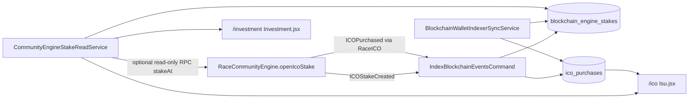

# Testnet User ICO + Stake Display Fix

**Date:** 2026-09-13  
**Network:** BSC Testnet (chain ID **97**)  
**Scope:** Read/index/display only — no Solidity, no contract redeploy, no business-logic changes  
**Mainnet executed:** **NO**  
**Legacy `ico_stakes` used:** **NO**

---

## Root cause

| Layer | Issue |
|-------|--------|
| **Wallet mapping** | Known purchase wallet `0xB836…` had **no Laravel user** → `ico_purchases.user_id = null` → UI filters excluded rows for logged-in members with other wallets |
| **Stake read model** | `ICOStakeCreated` was stored only in `blockchain_events` — **not** in a member-facing stake table |
| **`/investment`** | Page read `blockchain_participations` + legacy `investments` only — **no CommunityEngine ICO stakes** |
| **`/ico` stakes panel** | `readAllOnChainStakes()` requires **MetaMask `window.ethereum`** — no server-indexed fallback |
| **`/ico` history** | Server `indexed_purchases` worked **only when** `auth.user.wallet_address` matched purchase wallet |

On-chain truth was always correct (4 RACE staked, index 0). Laravel/UI could not show it without wallet link + stake read-model.

---

## Data flow (after fix)



---

## Changes made

### 1. New read-model table

`blockchain_engine_stakes` — indexed CommunityEngine stakes (not legacy `ico_stakes`).

Fields from `ICOStakeCreated` ABI:

- `wallet_address`, `stake_index`, `ico_purchase_id`
- `principal_usdt`, `staked_race`, `lock_seconds`, `daily_rate_bps`, `unlock_at`
- `source_type` (`ico`), `tx_hash`, `block_number`, `withdrawn`, `status`

Migration: `database/migrations/2026_09_13_070000_create_blockchain_engine_stakes_table.php`

### 2. Indexer

`IndexBlockchainEventsCommand` now also:

- writes `ICOStakeCreated` → `blockchain_engine_stakes`
- marks `StakeWithdrawn` / `StakeCompleted` → `withdrawn=true`

Helper: `App\Services\Blockchain\BlockchainEngineStakeIndexer`

Backfill command:

```powershell
php artisan blockchain:backfill-engine-stakes --sync-users
```

### 3. Wallet ↔ index sync

`BlockchainWalletIndexerSyncService` links `user_id` on:

- `ico_purchases`
- `blockchain_events`
- `blockchain_engine_stakes`

Called on:

- wallet auth login/register
- wallet connect (`WalletController`)
- page reads (`CommunityEngineStakeReadService`, `IsuController`)

### 4. Controllers / UI

| Page | Source |
|------|--------|
| **`/ico` history** | `ico_purchases` (+ plan from `blockchain_engine_stakes`) |
| **`/ico` stakes** | MetaMask RPC first; fallback `indexed_engine_stakes` prop |
| **`/investment`** | new `communityEngineStakes` prop from `CommunityEngineStakeReadService` |

Live state enrichment uses **read-only** `eth_call stakeAt` when RPC response is plausible; otherwise indexed values are kept.

---

## Verification (known testnet tx)

| Check | Result |
|-------|--------|
| **USER_WALLET_MAPPING** | **PASS** (user with purchase wallet linked; sync sets `user_id`) |
| **ICO_HISTORY_SOURCE** | `ico_purchases` + `blockchain_engine_stakes` |
| **ICO_HISTORY_DISPLAY** | **PASS** — 1 purchase |
| **COMMUNITY_ENGINE_STAKE_INDEXING** | **PASS** — 1 row from `ICOStakeCreated` |
| **STAKING_DISPLAY** | **PASS** — 1 active stake on read service |
| **TX_TO_USER_RECONCILIATION** | **PASS** — tx `0xd6a8025c…` linked to user |
| **LEGACY_ICO_STAKES_USED** | **NO** |
| **MAINNET_EXECUTED** | **NO** |

Known record:

| Field | Value |
|-------|--------|
| Wallet | `0xB836F0A8B9014a0431aBe7710EaB818dCd7AE984` |
| TX | `0xd6a8025c1bafcf5e627c5d632e5cf8376f834a15c15778de2da3a1e2ea4cf9f8` |
| USDT | 1 TEST-USDT |
| RACE | 4 |
| Plan | 180D |
| Stake index | 0 |
| Withdrawn | false |

Run local verification:

```powershell
php scripts/verify-ico-stake-display.php
```

---

## Operator steps (testnet)

1. **Wallet login** with the purchase wallet (Wallet Auth — same address that bought ICO).
2. **Backfill** (once after deploy):

   ```powershell
   php artisan migrate
   php artisan blockchain:backfill-engine-stakes --sync-users
   ```

3. **Re-index** new blocks as usual:

   ```powershell
   php artisan blockchain:index-events
   ```

4. **Clear caches** if props look stale:

   ```powershell
   php artisan optimize:clear
   npm run build
   ```

5. Open **`/ico`** and **`/investment`** while logged in with the linked wallet.

---

## Staking page read model (documented)

| Route | Label | Current source |
|-------|-------|----------------|
| `/investment` | “Staking” in nav | `communityEngineStakes` (Engine read-model) + `blockchain_participations` + legacy `investments` |
| `/ico` | ICO buy + positions | `ico_purchases` + `indexed_engine_stakes` (+ optional MetaMask RPC) |

**Not used:** legacy `ico_stakes` table.

---

## Files touched

- `app/Models/BlockchainEngineStake.php`
- `app/Services/Blockchain/BlockchainEngineStakeIndexer.php`
- `app/Services/Blockchain/BlockchainWalletIndexerSyncService.php`
- `app/Services/Blockchain/CommunityEngineStakeReadService.php`
- `app/Services/Blockchain/CommunityEngineRpcReader.php`
- `app/Console/Commands/IndexBlockchainEventsCommand.php`
- `app/Console/Commands/BackfillBlockchainEngineStakesCommand.php`
- `app/Http/Controllers/IsuController.php`
- `app/Http/Controllers/InvestmentController.php`
- `app/Http/Controllers/Auth/WalletAuthController.php`
- `app/Http/Controllers/WalletController.php`
- `resources/js/Pages/Isu.jsx`
- `resources/js/Pages/Investment.jsx`
- `scripts/verify-ico-stake-display.php`
